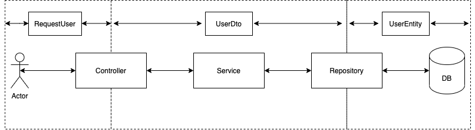

# User Service 

## Intro

- 사용자 등록, 수정, 삭제, 조회
	- Security를 통한 비밀번호 암호화
	- 인증, 인가
	- JWT

## 사용자 등록 프로세스

- 사용자 등록
	- 사용자의 등록 요청
	- 비밀번호 암호화
	- 생성된 사용자 아이디와 이메일, 이름을 반환

## 사용자 조회

## 사용자 로그인

- JWT
